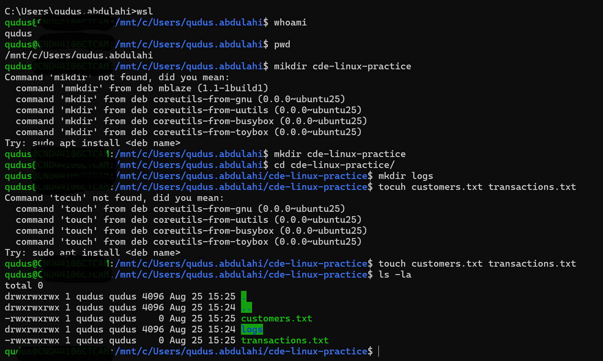
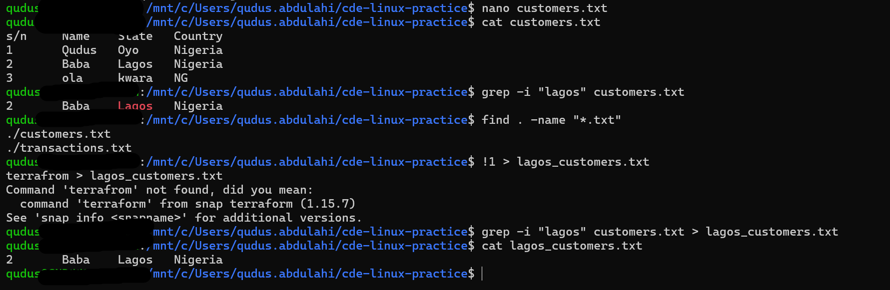
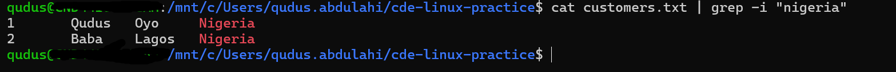
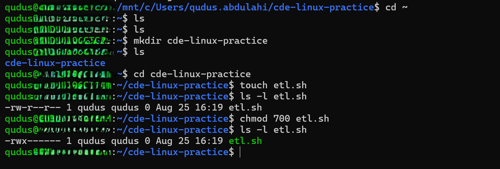

# Linux Hands-on Practice

This document captures the practical Linux exercises I completed during the bootcamp. The goal was not only to run commands, but to understand what each command does, observe the output, and connect the exercises to situations I may encounter in data engineering.

---

## Exercise 1: Navigation and File Management

### Objective

Practise basic Linux navigation, create directories and files, and inspect the working directory.

### Commands Used

```bash
whoami
pwd
mkdir cde-linux-practice
cd cde-linux-practice
mkdir logs
touch customers.txt transactions.txt
ls -la
```

### What I Did

I first checked the currently logged-in user with `whoami` and confirmed my current directory with `pwd`.

I then created a working directory called `cde-linux-practice`, moved into it, created a `logs` directory, and created two empty files: `customers.txt` and `transactions.txt`.

Finally, I used `ls -la` to inspect the contents of the directory, including file ownership and permissions.

### What I Learned

This exercise helped me understand how to:

- identify the current Linux user
- confirm my current location in the filesystem
- create directories
- create empty files
- navigate between directories
- inspect files, directories, ownership, and permissions

One useful observation was that `ls -la` gives much more information than a normal `ls`, including hidden files and permission details.

### Proof of Work



---

## Exercise 2: Searching Files, Filtering Data, and Output Redirection

### Objective

Practise working with text files using `cat`, `grep`, `find`, and output redirection.

### Sample Data

I created a small customer dataset inside `customers.txt`.

```text
s/n     Name    State   Country
1       Qudus   Oyo     Nigeria
2       Baba    Lagos   Nigeria
3       Ola     Kwara   NG
```

### Commands Used

```bash
cat customers.txt
grep -i "lagos" customers.txt
find . -name "*.txt"
grep -i "lagos" customers.txt > lagos_customers.txt
cat lagos_customers.txt
```

### What I Did

I used `cat` to display the contents of `customers.txt`.

I then searched for the word `Lagos` using:

```bash
grep -i "lagos" customers.txt
```

The `-i` option made the search case-insensitive.

Next, I used:

```bash
find . -name "*.txt"
```

to locate all `.txt` files within the current directory.

I also redirected the result of the `grep` command into a new file:

```bash
grep -i "lagos" customers.txt > lagos_customers.txt
```

and confirmed the output using:

```bash
cat lagos_customers.txt
```

### What I Learned

This exercise helped me understand the difference between `grep` and `find`.

- `grep` searches **inside files** for matching text.
- `find` searches the filesystem for **files or directories** matching a condition.

I also practised output redirection:

- `>` writes command output to a file and replaces the existing contents.
- `>>` appends command output to an existing file instead of replacing it.

This is useful when command results need to be saved for later use or passed into another process.

### Proof of Work



---

## Exercise 3: Working with Pipes

### Objective

Understand how the output of one Linux command can become the input of another command.

### Command Used

```bash
cat customers.txt | grep -i "nigeria"
```

### What I Did

I displayed the contents of `customers.txt` using `cat`, then passed that output into `grep` using the pipe operator `|`.

The `grep` command then filtered the incoming data and returned only the records containing the word `Nigeria`.

### What I Learned

A pipe allows separate Linux commands to work together.

In this example:

```bash
cat customers.txt | grep -i "nigeria"
```

the flow is:

```text
customers.txt
     |
    cat
     |
  stdout
     |
    grep
     |
filtered output
```

Instead of having one large command do everything, Linux allows smaller commands to be combined.

This is an important concept because the same idea appears repeatedly in automation and data engineering: one operation produces output that becomes the input for the next operation.

### Proof of Work



---

## Exercise 4: Linux File Permissions

### Objective

Practise viewing and changing Linux file permissions using `ls -l` and `chmod`.

### Commands Used

```bash
touch etl.sh
ls -l etl.sh
chmod 700 etl.sh
ls -l etl.sh
```

### Initial Permission

After creating `etl.sh`, I checked the permissions:

```text
-rw-r--r--
```

This can be interpreted as:

```text
Owner:  rw-
Group:  r--
Other:  r--
```

### Changing the Permission

I then ran:

```bash
chmod 700 etl.sh
```

The numeric value `700` represents:

```text
7 = rwx = read + write + execute
0 = --- = no permission
0 = --- = no permission
```

After running `chmod`, the permission became:

```text
-rwx------
```

This means:

```text
Owner:  read + write + execute
Group:  no permission
Other:  no permission
```

### A Problem I Encountered

I initially performed this exercise inside:

```text
/mnt/c/Users/...
```

which is the Windows filesystem mounted inside WSL.

I ran:

```bash
chmod 700 etl.sh
```

but the permission still appeared as:

```text
-rwxrwxrwx
```

At first, I thought the `chmod` command had failed.

I later learned that files stored under `/mnt/c` are on the Windows NTFS filesystem, and their Linux permissions may behave differently because WSL is accessing a mounted Windows filesystem.

I moved the exercise into my native WSL Linux home directory:

```bash
cd ~
mkdir cde-linux-practice
cd cde-linux-practice
touch etl.sh
chmod 700 etl.sh
ls -l etl.sh
```

This time, the permission changed correctly to:

```text
-rwx------
```

### What I Learned

This exercise taught me two things.

First, I now understand Linux file permissions more clearly.

| Permission | Symbol | Value |
|---|---:|---:|
| Read | `r` | 4 |
| Write | `w` | 2 |
| Execute | `x` | 1 |

Common combinations include:

```text
7 = rwx
6 = rw-
5 = r-x
4 = r--
0 = ---
```

Second, I learned that the filesystem where a file is stored can affect how Linux permissions behave.

The difference between `/mnt/c/...` and `/home/...` was something I had not considered before this exercise.

This was probably the most useful troubleshooting lesson from the practical session because I encountered an unexpected result, investigated it, and understood why it happened.

### Proof of Work



---

# Overall Reflection

The biggest takeaway from these exercises is that Linux becomes easier to understand when the commands are used together rather than memorised individually.

For example:

- `pwd` helps me understand where I am.
- `ls` helps me inspect what is there.
- `grep` helps me search data.
- `find` helps me locate files.
- `>` and `>>` help me redirect output.
- `|` allows commands to work together.
- `chmod` controls who can access or execute a file.

I also learned that troubleshooting is part of the learning process.

The `chmod` issue in WSL was not part of the original exercise, but understanding why it happened gave me a better appreciation of the difference between a native Linux filesystem and a mounted Windows filesystem.

---

# Connection to Data Engineering

These commands are basic, but I can already see how they connect to data engineering work.

A data engineer may need to:

- navigate a remote Linux server
- inspect directories containing pipeline files
- search log files for errors
- monitor a log using `tail -f`
- filter command output using `grep`
- locate configuration files with `find`
- manage file permissions for scripts
- store configuration in environment variables
- combine commands in shell scripts
- troubleshoot processes running on Linux servers

This makes Linux less of a separate topic and more of a foundation for many of the tools I will encounter later in the bootcamp.

---

# Next Areas I Want to Practise

I want to continue building confidence with:

- shell scripting
- processes and process management
- `ps`, `top`, and `htop`
- SSH and remote server access
- `tail -f` for monitoring logs
- `cron` for scheduled jobs
- environment variables
- disk and memory monitoring
- Linux networking
- running and troubleshooting data pipelines on Linux
::: ​​