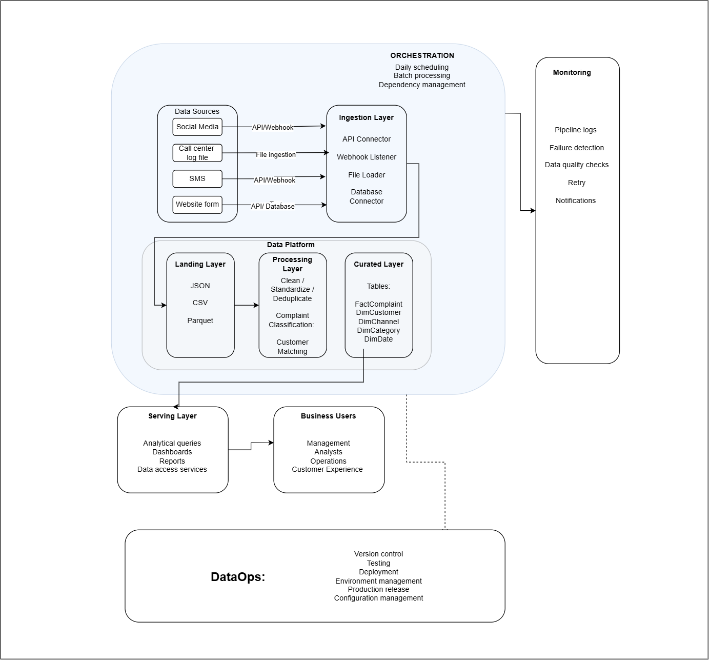

# Conceptual End-to-End Customer Complaint Data Pipeline

## Overview

This project presents a conceptual end-to-end data pipeline for collecting, processing, storing, and serving customer complaint and interaction data from multiple business channels.

The objective of the pipeline is to provide the business with a unified and reliable view of customer complaints across different channels, including:

- Social media
- Call center log files
- SMS
- Website forms

The pipeline is designed based on the assumption that the business requires refreshed complaint information **once per day**.

For this reason, the solution follows a **daily batch-processing approach** rather than introducing unnecessary real-time processing complexity.

The architecture covers the complete data lifecycle:

1. Source identification
2. Data ingestion
3. Landing and storage
4. Processing and transformation
5. Curated analytical data
6. Data serving
7. Orchestration and monitoring
8. DataOps and production management

---

## Architecture Diagram

The conceptual architecture for the pipeline is shown below.



> The architecture is intentionally technology-agnostic. It describes the responsibilities and behaviour of each component rather than selecting specific implementation tools.

---

# 1. Source Identification

The pipeline receives customer complaint and interaction data from four main sources.

## Social Media

Social media platforms may contain customer comments, complaints, enquiries, reactions, and other interactions relating to the organisation.

Relevant information may include:

- Customer or platform identifier
- Message or comment
- Date and time
- Social media channel
- Post or conversation identifier
- Complaint content
- Interaction status

The data will be retrieved through an API.

The expected source format is primarily structured or semi-structured data such as **JSON**.

Although social media activity occurs continuously, the business requirement does not require immediate processing.

The data will therefore be collected as part of the scheduled daily ingestion process.

---

## Call Center Log Files

The call center produces files containing details of customer interactions handled by customer service representatives.

Typical information may include:

- Call identifier
- Customer identifier
- Agent
- Call date
- Start time
- End time
- Call duration
- Complaint description
- Call outcome
- Resolution status

The source is expected to provide files such as:

- CSV
- Text/log files
- Other structured file formats

These files will be ingested using a scheduled file-ingestion process.

---

## SMS

SMS interactions may contain information relating to customer enquiries, complaints, notifications, responses, and message delivery.

Typical information may include:

- Message identifier
- Customer phone number
- Message content
- Date and time
- Message status
- Direction
- Campaign or service identifier

SMS information will be extracted through an API.

The expected format will primarily be JSON or another structured response format.

Although SMS events may be generated continuously, they will be incorporated into the daily batch processing cycle.

---

## Website Form

Customers may also submit complaints or enquiries through forms available on the organisation's website.

Typical fields may include:

- Customer name
- Email address
- Phone number
- Complaint
- Complaint category
- Submission date
- Reference number

The information may be retrieved through either:

- API ingestion, or
- Database ingestion

The appropriate method depends on how the website application stores submitted forms.

---

## Source Summary

| Source | Ingestion Method | Typical Format | Processing Frequency |
|---|---|---|---|
| Social Media | API ingestion | JSON | Daily batch |
| Call Center | File ingestion | CSV / Log file | Daily batch |
| SMS | API ingestion | JSON | Daily batch |
| Website Form | API / Database ingestion | Structured records / JSON | Daily batch |

---

# 2. Ingestion Strategy

The ingestion layer is responsible for moving data from the source systems into the data platform.

Different ingestion approaches are required because the sources expose their data differently.

The conceptual ingestion layer contains:

- API Connector
- File Loader
- Database Connector

## API Ingestion

API ingestion will be used for sources such as:

- Social media
- SMS

The pipeline will request the required information from each source during the scheduled daily pipeline execution.

Where possible, the extraction should be incremental.

Instead of retrieving the complete historical dataset every day, the process should retrieve only records that are new or have changed since the previous successful ingestion.

For example:

```text
Previous successful load
        ↓
Identify latest processed timestamp
        ↓
Request newer records
        ↓
Load new records
```

This reduces unnecessary processing and improves pipeline efficiency.

## File Ingestion

The call center produces log files that need to be loaded into the platform.

The pipeline will identify newly available files and ingest them into the landing layer.

Metadata should be maintained for each ingested file, including:

- File name
- File creation date
- Ingestion date
- Source
- Processing status

This prevents the same file from being unintentionally loaded multiple times.

## Database Ingestion

Website form submissions may already exist inside an operational application database.

Where this is the case, the ingestion layer can retrieve new records directly from the source database.

Incremental extraction should use a suitable field such as:

- Created timestamp
- Updated timestamp
- Sequential identifier

where these are available.

## Handling Real-Time Sources

Some of the sources, particularly social media and SMS, naturally generate information in real time.

However, real-time processing is not currently required by the business.

The stated business requirement is for the information to be available on a **daily basis**.

Therefore, real-time events will remain within their source systems until they are collected during the next scheduled ingestion cycle.

This decision keeps the architecture simpler while still satisfying the business requirement.

If the business requirement changes in the future, the architecture can later be extended to support near-real-time or event-based ingestion.

---

# 3. Landing Layer

The landing layer is the first storage location for data entering the platform.

Its main purpose is to preserve data as close as possible to its original source representation before business transformations are applied.

Possible formats include:

- JSON
- CSV
- Parquet

The landing layer provides several benefits.

### Traceability

Original source data remains available for investigation.

### Reprocessing

If transformation logic changes, historical raw data can be processed again without retrieving everything from the source.

### Auditability

The organisation can compare transformed data with the original source records.

### Isolation

Errors in transformation logic do not affect the source systems.

The landing layer should also maintain ingestion metadata such as:

- Source system
- Ingestion timestamp
- Source file name
- Batch identifier
- Record creation date
- Processing status

---

# 4. Processing and Transformation

After data has been successfully ingested into the landing layer, it moves into the processing layer.

The processing layer converts inconsistent source data into reliable and standardised business information.

The major transformation activities include:

- Data cleaning
- Data standardisation
- Deduplication
- Complaint classification
- Customer matching

## Data Cleaning

Incoming data may contain:

- Missing values
- Invalid values
- Incorrect dates
- Incomplete customer details
- Malformed records
- Unexpected characters

Cleaning rules should identify and correct valid problems where possible.

Records that cannot be corrected should be identified for investigation rather than silently discarded.

## Data Standardisation

The four source systems may represent the same information differently.

For example, channel values might appear as:

```text
Instagram
IG
instagram
INSTAGRAM
```

These should be transformed into a consistent value such as:

```text
Instagram
```

Other standardisation activities may include:

- Date formats
- Phone numbers
- Customer identifiers
- Complaint statuses
- Channel names
- Complaint categories
- Text formatting

---

# 5. Deduplication

Duplicate records may occur during ingestion.

For example:

- The same API records may accidentally be retrieved more than once.
- A call center file may be processed twice.
- A customer may submit the same website form repeatedly.
- The same source record may be present in multiple extraction batches.

Deduplication should therefore occur before records enter the curated analytical layer.

Where available, source-system identifiers should be used.

For example:

```text
Source + SourceRecordID
```

may provide a reliable unique identifier.

Where a unique identifier is not available, a combination of attributes may be required.

For example:

```text
Customer
+
Channel
+
Complaint timestamp
+
Complaint content
```

The exact rule will depend on the source data.

---

# 6. Complaint Classification

Complaints coming from different channels are unlikely to arrive with consistent categories.

For example, customers may write:

```text
"My transfer has been pending since yesterday."
```

or:

```text
"I cannot access my account."
```

The processing layer should assign standard complaint categories.

Possible categories may include:

- Account access
- Transaction issues
- Service quality
- Payment issues
- Technical problems
- Customer service
- Product enquiry
- Other

The objective is to transform unstructured or inconsistently categorised complaints into standard categories that can be analysed across all channels.

For example:

```text
Customer Complaint
        ↓
Classification
        ↓
Transaction Issue
```

Complaint classification allows the business to identify:

- Most common complaints
- Complaint trends
- Problematic channels
- Recurring service issues
- Changes in customer experience

---

# 7. Customer Matching

A customer may interact with the organisation through several channels.

For example, the same customer could:

1. Submit a website complaint
2. Receive an SMS
3. Call the call center
4. Post about the issue on social media

Without customer matching, these interactions may appear to belong to different customers.

The processing layer should therefore attempt to match customer records using available identifiers such as:

- Customer ID
- Phone number
- Email address
- Account number
- Other trusted business identifiers

The goal is to create a consistent customer reference that can be used in the curated layer.

This allows the organisation to analyse the customer's complete interaction history rather than treating every channel independently.

---

# 8. Curated Layer

After the data has been cleaned, standardised, classified, deduplicated, and matched, it is moved into the curated layer.

The curated layer contains business-ready data optimised for analytical use.

A dimensional model is proposed.

The main tables include:

```text
FactComplaint
DimCustomer
DimChannel
DimCategory
DimDate
```

## FactComplaint

`FactComplaint` represents individual complaint events.

Possible fields include:

```text
ComplaintKey
CustomerKey
ChannelKey
CategoryKey
DateKey
SourceComplaintID
ComplaintText
ComplaintStatus
ResolutionStatus
ComplaintTimestamp
ResolutionTimestamp
```

This table forms the central fact table for complaint analysis.

## DimCustomer

Contains standardised customer information.

Possible fields:

```text
CustomerKey
CustomerID
CustomerName
CustomerType
Email
PhoneNumber
```

## DimChannel

Describes the source channel through which the complaint was received.

Example values:

```text
Social Media
Call Center
SMS
Website
```

## DimCategory

Contains the standard complaint classification.

Example values:

```text
Transaction Issue
Account Access
Service Quality
Payment Issue
Technical Problem
Other
```

## DimDate

Provides calendar attributes used for time-based analysis.

Possible attributes include:

```text
Date
Day
Week
Month
Quarter
Year
```

This makes it easier for downstream users to analyse complaint trends over different periods.

---

# 9. Storage Strategy

The architecture uses different storage approaches for different stages of the data lifecycle.

## Raw / Landing Storage

Raw and semi-structured source data will be stored in formats such as:

- JSON
- CSV
- Parquet

This data is retained primarily for:

- Audit
- Historical reference
- Reprocessing
- Troubleshooting

## Curated Analytical Storage

Cleaned and transformed information will be stored in structured analytical tables.

The curated layer therefore behaves as the analytical data warehouse component of the platform.

This separation creates the following flow:

```text
Raw Data
    ↓
Landing Layer
    ↓
Transformation
    ↓
Curated Analytical Tables
```

The architecture therefore supports both flexible raw-data storage and structured analytical storage.

---

# 10. Serving Layer

The serving layer makes curated information available to downstream consumers.

The primary access methods include:

- Analytical queries
- Dashboards
- Reports
- Data access services

Only curated and validated information should normally be exposed to business users.

Users should not need to understand how the original social media, call center, SMS, or website systems structure their data.

The serving layer provides them with consistent business information.

---

# 11. Business Users

The primary consumers of the data include:

### Management

Management can use the information to monitor:

- Complaint volumes
- Complaint trends
- Service performance
- Major customer issues
- Resolution performance

### Analysts

Analysts can perform deeper investigation into:

- Complaint behaviour
- Channel performance
- Customer interaction patterns
- Historical trends
- Recurring service issues

### Operations

Operations teams can identify operational problems requiring attention.

### Customer Experience

Customer experience teams can use the information to understand:

- Common customer pain points
- Customer behaviour across channels
- Resolution effectiveness
- Changes in customer sentiment and complaints

---

# 12. Orchestration

Orchestration coordinates the execution of the different pipeline stages.

The pipeline will operate using a **daily scheduled batch**.

A simplified execution sequence is:

```text
Start Daily Pipeline
        ↓
Ingest Source Data
        ↓
Validate Ingestion
        ↓
Load Landing Layer
        ↓
Clean and Transform
        ↓
Deduplicate
        ↓
Classify Complaints
        ↓
Match Customers
        ↓
Load Curated Tables
        ↓
Make Data Available
        ↓
Complete
```

Dependency management ensures that downstream processes do not begin before their required upstream processes have completed successfully.

For example:

```text
Ingestion
    ↓
Landing
    ↓
Processing
    ↓
Curated
    ↓
Serving
```

If ingestion fails, processing should not continue using incomplete data.

---

# 13. Monitoring

The monitoring component provides visibility into pipeline health.

The main monitoring responsibilities include:

- Pipeline logs
- Failure detection
- Data quality checks
- Retry handling
- Notifications

## Pipeline Logs

Each pipeline execution should record information such as:

- Start time
- End time
- Source
- Number of records received
- Number of records processed
- Number of records rejected
- Processing status
- Error details

## Failure Detection

Failures should be automatically detected at each stage.

Possible failures include:

- Source unavailable
- API request failure
- Missing file
- Invalid file
- Schema changes
- Transformation errors
- Storage failures

## Retry Handling

Temporary failures should be retried where appropriate.

For example:

```text
Process fails
      ↓
Retry
      ↓
Successful?
  ↙       ↘
Yes       No
 ↓         ↓
Continue   Notify
```

Permanent or repeated failures should not be ignored.

## Notifications

Relevant support personnel should be notified when important pipeline failures occur.

Notifications should contain enough information to identify:

- Pipeline stage
- Failure time
- Data source
- Error description
- Processing batch

---

# 14. Data Quality

Data quality checks should occur before data is promoted into the curated layer.

Possible checks include:

### Completeness

Required fields should not be unexpectedly empty.

### Uniqueness

Duplicate complaint records should be identified.

### Validity

Values should follow valid business rules.

### Consistency

Values representing the same business concept should use the same format.

### Referential Integrity

Relationships between fact and dimension records should remain valid.

### Volume Checks

Unexpected increases or decreases in source-record volumes should be investigated.

Records that fail important quality checks should not silently enter the curated analytical dataset.

---

# 15. DataOps

DataOps practices support the development, testing, deployment, and maintenance of the pipeline.

The conceptual DataOps responsibilities include:

- Version control
- Testing
- Deployment
- Environment management
- Production release
- Configuration management

## Version Control

Pipeline definitions, transformation logic, data models, and configuration should be version controlled.

This makes it possible to:

- Track changes
- Review modifications
- Restore previous versions
- Collaborate safely

## Testing

Changes should be validated before being introduced into production.

Testing may include:

- Transformation testing
- Data-quality testing
- Schema validation
- Integration testing
- Pipeline execution testing

## Environment Management

Separate environments should be maintained for different stages of development.

Conceptually:

```text
Development
     ↓
Testing
     ↓
Production
```

Changes should first be developed and validated outside production.

Only approved and tested changes should be released into the production environment.

## Production Release

The production pipeline should execute independently according to its defined daily schedule.

Releases should follow a controlled process so that changes to ingestion, transformation, storage, or serving logic do not unexpectedly disrupt business reporting.

## Configuration Management

Environment-specific information should be separated from pipeline logic.

Examples include:

- Source locations
- Connection information
- Scheduling configuration
- File paths
- Environment settings

This allows the same pipeline design to operate consistently across development, testing, and production environments.

---

# 16. End-to-End Data Flow

The complete conceptual flow can be summarised as:

```text
                DATA SOURCES
                     │
       ┌─────────────┼──────────────┐
       │             │              │
 Social Media   Call Center        SMS
       │           Log File         │
       │             │              │
       └─────────────┼──────────────┘
                     │
               Website Form
                     │
                     ▼
              INGESTION LAYER
                     │
                     ▼
               LANDING LAYER
                     │
                     ▼
              PROCESSING LAYER
                     │
       ┌─────────────┼─────────────┐
       │             │             │
     Clean       Deduplicate    Standardize
       │             │             │
       └─────────────┼─────────────┘
                     │
          Complaint Classification
                     │
              Customer Matching
                     │
                     ▼
               CURATED LAYER
                     │
                     ▼
                SERVING LAYER
                     │
                     ▼
               BUSINESS USERS
```

The entire lifecycle is supported by:

```text
Orchestration
Monitoring
Data Quality
DataOps
```

---

# 17. Key Design Decisions

Several important decisions were made when designing this architecture.

### Daily Batch Processing

The business requires refreshed information daily.

Although some source systems generate data continuously, introducing real-time processing would add complexity without providing a current business benefit.

Daily batch processing is therefore considered sufficient.

### Multiple Ingestion Methods

The pipeline does not force every source into one ingestion mechanism.

Instead:

- APIs are used where systems expose APIs.
- Files are used where systems produce files.
- Database ingestion is used where application data exists in a database.

### Raw Data Retention

Source data is retained in the landing layer before transformation.

This supports:

- Auditability
- Troubleshooting
- Historical analysis
- Reprocessing

### Standardised Complaint Model

Different channels ultimately feed into one standard complaint model.

This prevents business users from having to analyse each communication channel separately.

### Customer Matching Across Channels

Customer interactions are linked where reliable customer identifiers are available.

This enables cross-channel customer analysis.

### Separation of Raw and Curated Data

Raw source data and analytical data have different purposes.

The architecture therefore separates:

```text
Raw / Landing Data
```

from:

```text
Curated / Business-Ready Data
```

### Monitoring and Data Quality

Pipeline success is not defined only by whether data moved successfully.

The architecture must also ensure that the resulting data is complete, valid, consistent, and usable.

Monitoring and quality checks are therefore part of the end-to-end design.

---

# 18. Assumptions

This conceptual architecture is based on the following assumptions:

1. The organisation requires customer complaint information once per day.
2. Real-time reporting is not currently a business requirement.
3. Required source-system access can be provided.
4. Each source contains enough information to identify or partially identify customer interactions.
5. Source-system timestamps or identifiers are available for incremental processing where possible.
6. Customer information can be matched using approved business identifiers.
7. Historical raw data should be retained for audit and reprocessing purposes.
8. Business users primarily consume curated analytical information rather than raw source data.

---

# 19. Future Considerations

The architecture can be extended if business requirements change.

Possible future enhancements include:

- Near-real-time complaint ingestion
- Automated customer sentiment analysis
- Advanced complaint classification
- Customer interaction journey analysis
- Automated complaint prioritisation
- Service-level monitoring
- Historical trend forecasting
- Additional customer communication channels

These capabilities are intentionally outside the current design because the objective is to satisfy the present daily reporting requirement without introducing unnecessary complexity.

---

# Conclusion

This project defines a conceptual end-to-end pipeline for integrating customer complaint information from social media, call center logs, SMS, and website forms.

The architecture provides a controlled flow from source systems through ingestion, raw storage, transformation, curated analytical storage, and finally to business users.

The design prioritises:

- Data quality
- Consistency
- Traceability
- Maintainability
- Reliable daily processing
- Cross-channel customer analysis
- Production readiness

By consolidating complaints from multiple customer channels into a common analytical structure, the organisation can obtain a more complete view of customer issues and provide management, analysts, operations, and customer experience teams with consistent information for decision-making.
